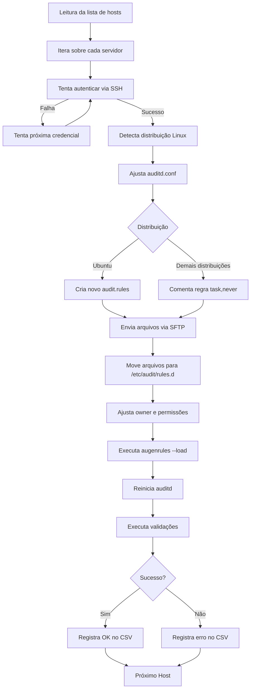

# Linux Audit Remote Deploy

Script desenvolvido em Python para automatizar a implantação de configurações de auditoria (`auditd`) em múltiplos servidores Linux através de conexão SSH.

O projeto realiza a preparação do ambiente, copia arquivos de configuração, aplica ajustes específicos conforme a distribuição Linux, recarrega as regras do Audit Framework e valida automaticamente a implantação, gerando um relatório consolidado em formato CSV. :contentReference[oaicite:0]{index=0}

---

# Objetivo

Padronizar e automatizar a configuração do Linux Audit Framework em ambientes Linux, reduzindo atividades manuais, minimizando erros operacionais e garantindo que todos os servidores recebam a mesma configuração de auditoria.

O processo contempla desde a preparação do ambiente até a validação final do serviço `auditd`.

---

# Funcionalidades

- Conexão SSH automática utilizando Paramiko
- Tentativa de autenticação utilizando múltiplas credenciais
- Cópia automática dos arquivos de auditoria via SFTP
- Ajuste do parâmetro `q_depth` no `auditd.conf`
- Tratamento específico para distribuições Ubuntu
- Tratamento específico para distribuições SUSE, RHEL, Oracle Linux e derivados
- Aplicação das permissões corretas dos arquivos enviados
- Recarregamento das regras do Audit Framework
- Reinicialização do serviço `auditd`
- Validação automática da configuração aplicada
- Geração de relatório em CSV
- Tratamento de erros de autenticação, SSH, timeout e permissões
- Modo Dry run (valida conexão, arquivos locais, diretórios remotos e comandos necessários)

---

# Arquitetura



---

# Estrutura do Projeto

```text
.
├── audit_remote.py
├── audit_clean.sh
├── customizedaudit.rules
├── .env
├── hosts.txt
├── resultado_copy_audit.csv
└── README.md
```

---

# Pré-requisitos

- Python 3.8 ou superior
- Acesso SSH aos servidores
- Permissão para utilização de sudo
- Paramiko

Instalação da dependência:

```bash
pip install paramiko
```

---

# Arquivos utilizados

## hosts.txt

Lista de servidores que receberão a configuração.

Exemplo:

```text
server01
server02
server03
```

---

## audit_clean.sh

Script responsável pela gravação das logs 
---

## customizedaudit.rules

Arquivo contendo as regras personalizadas de auditoria que serão implantadas nos servidores.

---

# Como funciona

Para cada servidor listado:

1. Realiza conexão SSH.
2. Detecta a distribuição Linux.
3. Ajusta o parâmetro `q_depth`.
4. Configura o `audit.rules` conforme a distribuição.
5. Copia os arquivos necessários.
6. Ajusta permissões.
7. Recarrega as regras.
8. Reinicia o serviço `auditd`.
9. Executa validações.
10. Registra o resultado no CSV.

---

# Compatibilidade

Atualmente o script possui tratamento para:

- Ubuntu
- SUSE Linux Enterprise
- Red Hat Enterprise Linux
- Oracle Linux
- Rocky Linux
- AlmaLinux
- CentOS

Distribuições derivadas que utilizem o Linux Audit Framework também são suportadas.

---

# Execução

```bash
python3 audit_remote.py \
    --hosts hosts.txt \
    --output resultado_copy_audit.csv
```

ou

```bash
python3 audit_remote.py -H hosts.txt
```

---

## Modo Dry Run

```bash
python3 audit_remote.py -H hosts.txt --dry-run
```
---

# Arquivos alterados nos servidores

O script modifica os seguintes arquivos:

```text
/etc/audit/auditd.conf

/etc/audit/rules.d/audit.rules

/etc/audit/rules.d/customizedaudit.rules

/etc/audit/rules.d/audit_clean.sh
```

Também executa:

```bash
augenrules --load

systemctl restart auditd
```

---

# Validações executadas

Após a implantação o script verifica automaticamente:

- Status do serviço `auditd`
- Carregamento das regras
- Valor do parâmetro `q_depth`
- Existência da regra `task,never`
- Saída do comando `auditctl`

Caso qualquer validação falhe, o host é registrado como erro.

---

# Relatório gerado

Ao final da execução é criado um relatório CSV contendo:

| Campo | Descrição |
|--------|-----------|
| host | Nome do servidor |
| user | Usuário utilizado |
| status | Resultado da execução |
| message | Detalhes da operação |

Exemplo:

```csv
host,user,status,message
server01,user,OK,Configuração aplicada
server02,user,AUTH_FAIL,Falha de autenticação
server03,user,SSH_FAIL,Timeout na conexão
```

---

# Tratamento de erros

O script identifica automaticamente situações como:

- Falha de autenticação
- Senha expirada
- Necessidade de troca de senha
- Timeout SSH
- Timeout de comandos
- Diretório inexistente
- Erros de permissão
- Falha na cópia de arquivos
- Falha na carga das regras
- Falha na reinicialização do serviço

---

# Configuração do `.env`

As credenciais SSH não devem ficar diretamente no código-fonte.

Crie um arquivo chamado `.env` na raiz do projeto:

```env
SSH_CREDENTIALS=user1:Senha@123,user2:OutraSenha@123
```

Exemplo com múltiplos usuários:

```env
SSH_CREDENTIALS=usuario1:senha1,usuario2:senha2,usuario3:senha3
```

O script irá ler essa variável e tentar autenticar em cada servidor utilizando as credenciais informadas, na ordem definida.

---

# `.env.example`
```env
SSH_CREDENTIALS=usuario1:senha1,usuario2:senha2
```

Esse arquivo serve apenas como modelo e não deve conter senhas reais.

---

# Segurança

As credenciais SSH devem ser armazenadas no arquivo `.env`, que não deve ser versionado no Git.

Adicione o `.env` ao `.gitignore`:

```gitignore
.env
__pycache__/
*.pyc
resultado_copy_audit.csv
```

Nunca faça commit de senhas, tokens ou qualquer informação sensível no repositório.

Caso alguma credencial seja enviada por engano para o Git, ela deve ser alterada imediatamente.

---

# Tecnologias utilizadas

- Python 3
- Paramiko
- SSH
- SFTP
- Linux Audit Framework (auditd)

---

# Licença

Este projeto é destinado ao uso interno para automação de configurações de auditoria em servidores Linux.
